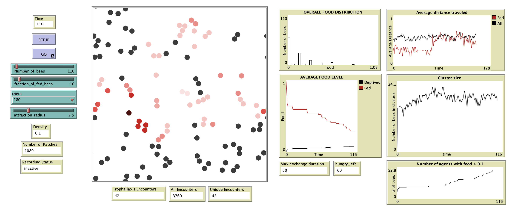

# Trophallaxis_ABM
This is an agent-based model of the honey bee interactions inspired by food exchange via trophallaxis. The motion of the agents is based on the idea of excluded volume so agents are not allowed to overlap at any timestep during the simulation. Initially, the fed agents are red and the deprived agents are gray. As the model progresses, the agents move while exchanging food and the model stops when the food is distributed almost evenly among all agents.

